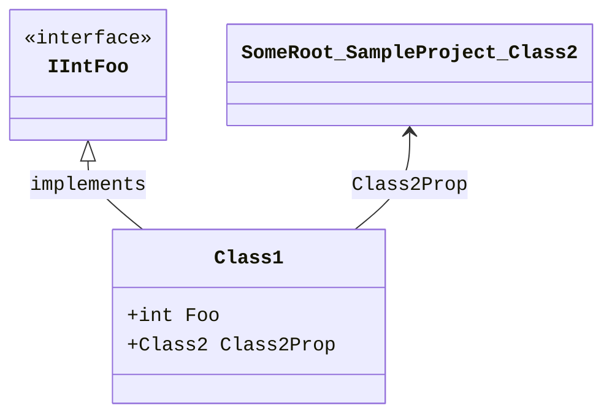
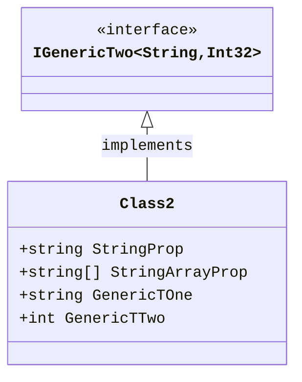
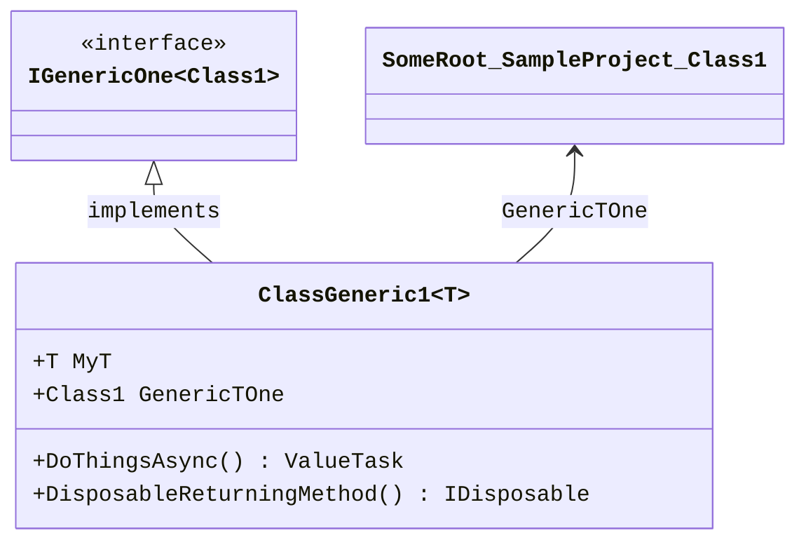
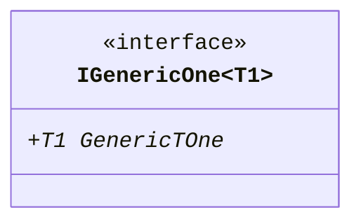
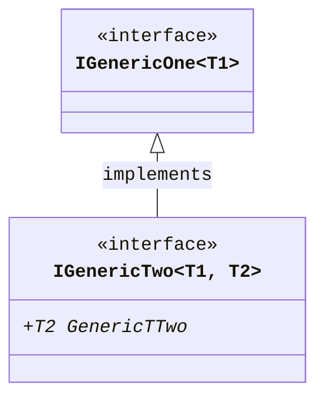
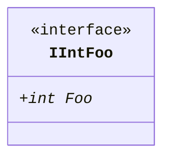
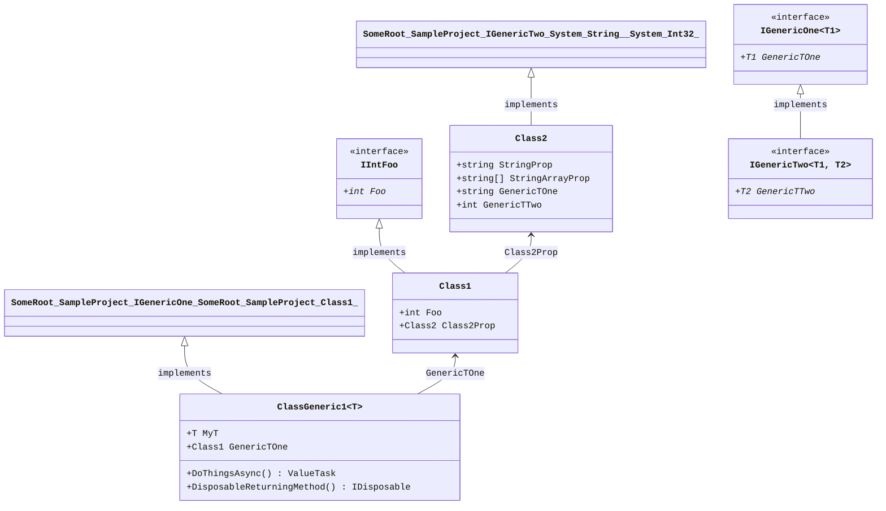

<!-- markdownlint-capture -->
<!-- markdownlint-disable -->

# Code Metrics

This file represents various [code metrics](https://aka.ms/dotnet/code-metrics), such as cyclomatic complexity, maintainability index, and so on.

## SampleProject ✅

The *SampleProject.csproj* project file contains:

- 1 namespaces.
- 6 named types.
- 37 total lines of source code.
- Approximately 2 lines of executable code.
- The highest cyclomatic complexity is 2 ✅.

  <strong id="someroot-sampleproject">
    SomeRoot.SampleProject ✅
  </strong>

 

The `SomeRoot.SampleProject` namespace contains 6 named types.

- 6 named types.
- 37 total lines of source code.
- Approximately 2 lines of executable code.
- The highest cyclomatic complexity is 2 ✅.

  <strong id="class1">
    Class1 ✅
  </strong>

 

- The `Class1` contains 2 members.
- 5 total lines of source code.
- Approximately 0 lines of executable code.
- The highest cyclomatic complexity is 2 ✅.

| Member kind | Line number | Maintainability index | Cyclomatic complexity | Depth of inheritance | Class coupling | Lines of source / executable code |
| :-: | :-: | :-: | :-: | :-: | :-: | :-: |
| Property | <a href='https://github.com/erichiller/gh-action-cs-metrics/blob/master/SampleProject/Class1.cs#L22' title='Class2 Class1.Class2Prop'>22</a> | 100 | 1 ✅ | 0 | 1 | 1 / 0 |
| Property | <a href='https://github.com/erichiller/gh-action-cs-metrics/blob/master/SampleProject/Class1.cs#L20' title='int Class1.Foo'>20</a> | 100 | 2 ✅ | 0 | 0 | 1 / 0 |

<a href="#Class1-class-diagram">🔗 to `Class1` class diagram</a>

<a href="#someroot-sampleproject">🔝 back to SomeRoot.SampleProject</a>

  <strong id="class2">
    Class2 ✅
  </strong>

 

- The `Class2` contains 4 members.
- 6 total lines of source code.
- Approximately 0 lines of executable code.
- The highest cyclomatic complexity is 2 ✅.

| Member kind | Line number | Maintainability index | Cyclomatic complexity | Depth of inheritance | Class coupling | Lines of source / executable code |
| :-: | :-: | :-: | :-: | :-: | :-: | :-: |
| Property | <a href='https://github.com/erichiller/gh-action-cs-metrics/blob/master/SampleProject/Class1.cs#L28' title='string Class2.GenericTOne'>28</a> | 100 | 1 ✅ | 0 | 0 | 1 / 0 |
| Property | <a href='https://github.com/erichiller/gh-action-cs-metrics/blob/master/SampleProject/Class1.cs#L29' title='int Class2.GenericTTwo'>29</a> | 100 | 1 ✅ | 0 | 0 | 1 / 0 |
| Property | <a href='https://github.com/erichiller/gh-action-cs-metrics/blob/master/SampleProject/Class1.cs#L27' title='string[] Class2.StringArrayProp'>27</a> | 100 | 1 ✅ | 0 | 0 | 1 / 0 |
| Property | <a href='https://github.com/erichiller/gh-action-cs-metrics/blob/master/SampleProject/Class1.cs#L26' title='string Class2.StringProp'>26</a> | 100 | 2 ✅ | 0 | 0 | 1 / 0 |

<a href="#Class2-class-diagram">🔗 to `Class2` class diagram</a>

<a href="#someroot-sampleproject">🔝 back to SomeRoot.SampleProject</a>

  <strong id="classgeneric1t">
    ClassGeneric1&lt;T&gt; ✅
  </strong>

 

- The `ClassGeneric1<T>` contains 4 members.
- 10 total lines of source code.
- Approximately 2 lines of executable code.
- The highest cyclomatic complexity is 1 ✅.

| Member kind | Line number | Maintainability index | Cyclomatic complexity | Depth of inheritance | Class coupling | Lines of source / executable code |
| :-: | :-: | :-: | :-: | :-: | :-: | :-: |
| Method | <a href='https://github.com/erichiller/gh-action-cs-metrics/blob/master/SampleProject/Class1.cs#L39' title='IDisposable ClassGeneric1<T>.DisposableReturningMethod()'>39</a> | 100 | 1 ✅ | 0 | 4 | 2 / 1 |
| Method | <a href='https://github.com/erichiller/gh-action-cs-metrics/blob/master/SampleProject/Class1.cs#L36' title='ValueTask ClassGeneric1<T>.DoThingsAsync()'>36</a> | 100 | 1 ✅ | 0 | 2 | 2 / 1 |
| Property | <a href='https://github.com/erichiller/gh-action-cs-metrics/blob/master/SampleProject/Class1.cs#L34' title='Class1 ClassGeneric1<T>.GenericTOne'>34</a> | 100 | 1 ✅ | 0 | 1 | 1 / 0 |
| Property | <a href='https://github.com/erichiller/gh-action-cs-metrics/blob/master/SampleProject/Class1.cs#L33' title='T ClassGeneric1<T>.MyT'>33</a> | 100 | 1 ✅ | 0 | 0 | 1 / 0 |

<a href="#ClassGeneric1&lt;T&gt;-class-diagram">🔗 to `ClassGeneric1&lt;T&gt;` class diagram</a>

<a href="#someroot-sampleproject">🔝 back to SomeRoot.SampleProject</a>

  <strong id="igenericonet1">
    IGenericOne&lt;T1&gt; ✅
  </strong>

 

- The `IGenericOne<T1>` contains 1 members.
- 3 total lines of source code.
- Approximately 0 lines of executable code.
- The highest cyclomatic complexity is 1 ✅.

| Member kind | Line number | Maintainability index | Cyclomatic complexity | Depth of inheritance | Class coupling | Lines of source / executable code |
| :-: | :-: | :-: | :-: | :-: | :-: | :-: |
| Property | <a href='https://github.com/erichiller/gh-action-cs-metrics/blob/master/SampleProject/Class1.cs#L8' title='T1 IGenericOne<T1>.GenericTOne'>8</a> | 100 | 1 ✅ | 0 | 0 | 1 / 0 |

<a href="#IGenericOne&lt;T1&gt;-class-diagram">🔗 to `IGenericOne&lt;T1&gt;` class diagram</a>

<a href="#someroot-sampleproject">🔝 back to SomeRoot.SampleProject</a>

  <strong id="igenerictwot1,+t2">
    IGenericTwo&lt;T1, T2&gt; ✅
  </strong>

 

- The `IGenericTwo<T1, T2>` contains 1 members.
- 3 total lines of source code.
- Approximately 0 lines of executable code.
- The highest cyclomatic complexity is 1 ✅.

| Member kind | Line number | Maintainability index | Cyclomatic complexity | Depth of inheritance | Class coupling | Lines of source / executable code |
| :-: | :-: | :-: | :-: | :-: | :-: | :-: |
| Property | <a href='https://github.com/erichiller/gh-action-cs-metrics/blob/master/SampleProject/Class1.cs#L12' title='T2 IGenericTwo<T1, T2>.GenericTTwo'>12</a> | 100 | 1 ✅ | 0 | 0 | 1 / 0 |

<a href="#IGenericTwo&lt;T1, T2&gt;-class-diagram">🔗 to `IGenericTwo&lt;T1, T2&gt;` class diagram</a>

<a href="#someroot-sampleproject">🔝 back to SomeRoot.SampleProject</a>

  <strong id="iintfoo">
    IIntFoo ✅
  </strong>

 

- The `IIntFoo` contains 1 members.
- 3 total lines of source code.
- Approximately 0 lines of executable code.
- The highest cyclomatic complexity is 2 ✅.

| Member kind | Line number | Maintainability index | Cyclomatic complexity | Depth of inheritance | Class coupling | Lines of source / executable code |
| :-: | :-: | :-: | :-: | :-: | :-: | :-: |
| Property | <a href='https://github.com/erichiller/gh-action-cs-metrics/blob/master/SampleProject/Class1.cs#L16' title='int IIntFoo.Foo'>16</a> | 100 | 2 ✅ | 0 | 0 | 1 / 0 |

<a href="#IIntFoo-class-diagram">🔗 to `IIntFoo` class diagram</a>

<a href="#someroot-sampleproject">🔝 back to SomeRoot.SampleProject</a>

<a href="#sampleproject">🔝 back to SampleProject</a>

## Metric definitions

  - **Maintainability index**: Measures ease of code maintenance. Higher values are better.
  - **Cyclomatic complexity**: Measures the number of branches. Lower values are better.
  - **Depth of inheritance**: Measures length of object inheritance hierarchy. Lower values are better.
  - **Class coupling**: Measures the number of classes that are referenced. Lower values are better.
  - **Lines of source code**: Exact number of lines of source code. Lower values are better.
  - **Lines of executable code**: Approximates the lines of executable code. Lower values are better.

## Mermaid class diagrams

##### `Class1` class diagram

##### `Class2` class diagram

##### `ClassGeneric1<T>` class diagram

##### `IGenericOne<T1>` class diagram

##### `IGenericTwo<T1, T2>` class diagram

##### `IIntFoo` class diagram

## Mermaid class diagrams

## All class diagrams

*This file is maintained by a bot.*

<!-- markdownlint-restore -->
